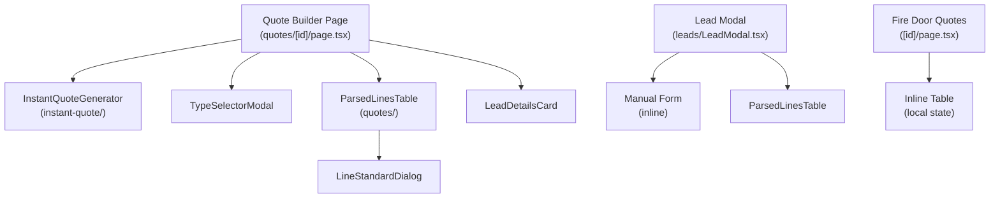

# Quote Line Item Creation - Comprehensive Analysis

**Date:** January 5, 2026  
**Status:** Currently fragmented across 5+ different UIs and components  
**Recommendation:** Consolidate into unified `UnifiedLineItemCreator` component

---

## Summary Table: All Line Item Creation Methods

| # | **Location** | **Component** | **Entry Type** | **Fields** | **Trigger** | **Line Count** |
|---|---|---|---|---|---|---|
| **1** | Quote Builder → Products Tab | Manual form in table row | Manual entry + dropdowns | Description, Qty, Width, Height, Timber, Finish, Ironmongery, Glazing | "Add Line Item" button | ~1500 lines |
| **2** | Quote Builder → AI Search | `InstantQuoteGenerator` | AI photo analysis + description | Photo upload, Description, Dimensions (W/H/D), Product type hint | "Generate Instant Quote" button | ~600 lines |
| **3** | Quote Builder → Type Selector | `TypeSelectorModal` + Product grid | Dropdown + configuration grid | Product category/type/option selector, Configuration questionnaire answers | "📦" button in manual form | Integrated |
| **4** | Parsed Supplier PDF Lines | `ParsedLinesTable` → `LineStandardDialog` | Edit existing OR quick inline | Qty, Unit Price, Width, Height, Timber, Finish, Ironmongery, Glazing, Description | "Edit" or "Quick" button on each line | ~980 lines |
| **5** | Lead Modal → Quote Tab | Manual form in "line items" section | Manual entry + dropdowns | Description, Qty, Unit Price, Width, Height, Timber, Finish, Ironmongery, Glazing | "Save Product Configuration" button | ~2700 lines |
| **6** | Fire Door Quotes | Inline table row | Manual entry specific to fire doors | Door Ref, Location, Quantity, Rating (FD30/60), Door Height, Master Width, Unit Value | "Add Line Item" button → `addLineItem()` | ~507 lines |

---

## Detailed Breakdown by Location

### **1. Quote Builder - Manual Line Item Form** 
**File:** [web/src/app/quotes/[id]/page.tsx](web/src/app/quotes/[id]/page.tsx#L1477-L1540)  
**Component:** Inline table row in "Products" tab  
**State Variables:** Lines 53-62
```
- newLineDesc (string)
- newLineQty (number | null)
- newLineUnitPrice (number | null)
- stdWidthMm (number | null)
- stdHeightMm (number | null)
- stdTimber (string)
- stdFinish (string)
- stdIronmongery (string)
- stdGlazing (string)
```

**Creation Handler:** [Lines 431-489](web/src/app/quotes/[id]/page.tsx#L431-L489)  
**Key Function:** `handleAddLineItem()` - async callback

**Form Fields in UI:** [Lines 1477-1620](web/src/app/quotes/[id]/page.tsx#L1477-L1620)
- Description (text input + 📦 product type button + 🪄 AI search button)
- Quantity (number input)
- Width/Height (number inputs)
- Timber/Finish/Ironmongery/Glazing (dropdown selects with hardcoded options)

**Flow:**
1. User enters description, qty, unit price, dimensions, materials
2. Clicks "Add Line Item" button (line 1636)
3. Saves config answers to quote.meta
4. Calls `createQuoteLine()` with description, qty, unitPrice
5. Updates returned line with `lineStandard` object (width, height, timber, etc.)
6. Resets all form fields

---

### **2. Quote Builder - AI Instant Quote Generator**
**File:** [web/src/components/instant-quote/InstantQuoteGenerator.tsx](web/src/components/instant-quote/InstantQuoteGenerator.tsx)  
**Component:** `InstantQuoteGenerator` (exported, reusable)  
**Used in:** [Quote builder page (line 1317)](web/src/app/quotes/[id]/page.tsx#L1317)

**Props:**
```typescript
{
  onAddToQuote?: (data: InstantQuoteResult, dims) => Promise<void>;
  productTypeHint?: { category, type?, option? } | null;
}
```

**Input Fields:**
- Photo upload (file picker) [Lines 374-397](web/src/components/instant-quote/InstantQuoteGenerator.tsx#L374-L397)
- Optional description (textarea) [Lines 374-397](web/src/components/instant-quote/InstantQuoteGenerator.tsx#L374-L397)
- Width/Height/Depth inputs (mm) [Lines 406-427](web/src/components/instant-quote/InstantQuoteGenerator.tsx#L406-L427)

**Creation Flow:** [Lines 228-250](web/src/components/instant-quote/InstantQuoteGenerator.tsx#L228-L250)
1. User uploads photo/enters description
2. Enters dimensions
3. Clicks "Generate Instant Quote"
4. Calls `/api/ai/estimate-components` → AI generates BOM & pricing
5. Displays results with components, cutting lists, total price
6. User clicks "Add to Quote" → calls `onAddToQuote` callback
7. **Handler in quote builder** [Lines 1329-1346](web/src/app/quotes/[id]/page.tsx#L1329-L1346):
   - Creates quote line with AI description + total price
   - Attaches `lineStandard` (widthMm, heightMm) + `meta.aiInstantQuote`

---

### **3. Quote Builder - Product Type Selector**
**File:** [web/src/app/quotes/[id]/page.tsx](web/src/app/quotes/[id]/page.tsx#L1346-L1450)  
**Components:** 
- `TypeSelectorModal` (imported, clicked via 📦 button)
- Product option dropdown [Lines 1360-1375](web/src/app/quotes/[id]/page.tsx#L1360-L1375)
- Configuration questions grid [Lines 1378-1430](web/src/app/quotes/[id]/page.tsx#L1378-L1430)

**State Variables:**
```
- selectedProductOptionId (string | null)
- configAnswers (Record<string, string>)
- configQuestions (derived from selected option's metadata)
```

**Integration with Manual Form:**
- Type selector button (📦) opens modal to browse products
- User selects product type → saves to `selectedProductOptionId`
- Selected option automatically includes in `lineStandard.productOptionId`
- Configuration answers saved to quote.meta before creating line

---

### **4. Parsed Supplier PDF Lines Editor**
**File:** [web/src/components/quotes/ParsedLinesTable.tsx](web/src/components/quotes/ParsedLinesTable.tsx)

#### **4a. Dialog Edit Mode** 
**Component:** `LineStandardDialog` [Lines 623-800](web/src/components/quotes/ParsedLinesTable.tsx#L623-L800)

**Triggered By:** "Edit" button [Line 550](web/src/components/quotes/ParsedLinesTable.tsx#L550)

**Form Fields:**
- Width/Height (number inputs) [Lines 677-693](web/src/components/quotes/ParsedLinesTable.tsx#L677-L693)
- Timber (select dropdown) [Lines 697-711](web/src/components/quotes/ParsedLinesTable.tsx#L697-L711)
- Finish (select dropdown) [Lines 713-727](web/src/components/quotes/ParsedLinesTable.tsx#L713-L727)
- Ironmongery (select dropdown) [Lines 729-743](web/src/components/quotes/ParsedLinesTable.tsx#L729-L743)
- Glazing (select dropdown) [Lines 745-759](web/src/components/quotes/ParsedLinesTable.tsx#L745-L759)
- Photo file IDs (text inputs)

#### **4b. Inline Quick Edit Mode**
**Location:** [Lines 394-478](web/src/components/quotes/ParsedLinesTable.tsx#L394-L478)  
**Triggered By:** "Quick" button [Line 383](web/src/components/quotes/ParsedLinesTable.tsx#L383)

**Inline Fields:**
- Description
- Width/Height (in grid)
- Timber/Finish/Ironmongery/Glazing (in grid)

**Both Modes Call:** `onLineChange()` callback with `{ lineStandard, qty, unitPrice }`  
**Type Signature:** [Line 24](web/src/components/quotes/ParsedLinesTable.tsx#L24)
```typescript
onLineChange: (_lineId: string, _payload: { qty?, unitPrice?, lineStandard? }) => Promise<void>
```

---

### **5. Lead Modal - Quote Line Items Panel**
**File:** [web/src/app/leads/LeadModal.tsx](web/src/app/leads/LeadModal.tsx)

**State Variables:** [Lines 2470+](web/src/app/leads/LeadModal.tsx#L2480)
```
- newLineDesc (string)
- newLineQty (number)
- newLineUnitPrice (number)
- stdWidthMm (number | null)
- stdHeightMm (number | null)
- stdTimber (string)
- stdFinish (string)
- stdIronmongery (string)
- stdGlazing (string)
```

**Creation Handler:** `saveProductConfiguration()` [Lines 2454-2514](web/src/app/leads/LeadModal.tsx#L2454-L2514)

**Form Fields:** Similar to Quote Builder manual form
- Description input
- Qty input
- Unit Price input
- Width/Height inputs
- Timber/Finish/Ironmongery/Glazing dropdowns

**Flow:**
1. Creates/reuses draft quote if needed
2. Calls `createQuoteLine()` with description, qty, unitPrice
3. Calls `updateQuoteLine()` with `lineStandard`
4. Resets all form fields

**Key Difference from Quote Builder:**
- Also has supplier PDF parsing: `applyParseToQuoteAndRender()` [Lines 2328-2360](web/src/app/leads/LeadModal.tsx#L2328-L2360)
- Includes ML parse testing: `testSupplierParse()` [Lines 2270-2345](web/src/app/leads/LeadModal.tsx#L2270-L2345)

---

### **6. Fire Door Quotes - Specialized Line Item Table**
**File:** [web/src/app/fire-door-quotes/[id]/page.tsx](web/src/app/fire-door-quotes/[id]/page.tsx)

**Line Item Type:** `FireDoorLineItem` [Lines 38-46](web/src/app/fire-door-quotes/[id]/page.tsx#L38-L46)
```typescript
{
  rowIndex: number;
  doorRef: string;
  location: string;
  quantity: number;
  rating: "FD30" | "FD60";
  doorHeight: number;
  masterWidth: number;
  unitValue: number;
  lineTotal: number;
}
```

**Creation:** `addLineItem()` [Lines 174-183](web/src/app/fire-door-quotes/[id]/page.tsx#L174-L183)
- Creates new item with:
  - Auto-generated doorRef: `DOOR-{index+1}`
  - Default rating: FD30
  - Default dimensions: 826mm width, 2040mm height
  - qty: 1

**Trigger:** "Add Line Item" button [Line 443](web/src/app/fire-door-quotes/[id]/page.tsx#L443)

**Current State:** Local component state (not API-integrated like Quote Builder)

---

## API Integration Points

### **Quote Builder / Lead Modal - API Calls**

**Create Line:**
```typescript
POST /quotes/:id/lines
Body: { description, quantity, unitPrice, notes? }
Returns: { ok: boolean, line: ParsedLineDto }
```
**Source:** [web/src/lib/api/quotes.ts](web/src/lib/api/quotes.ts#L335)

**Update Line Standard Fields:**
```typescript
PATCH /quotes/:id/lines/:lineId
Body: { lineStandard: { widthMm, heightMm, timber, finish, ironmongery, glazing, ... } }
```
**Source:** [web/src/lib/api/quotes.ts](web/src/lib/api/quotes.ts#L335)

---

## Field Inconsistencies & Duplication

| Field | Quote Builder | Lead Modal | ParsedLines | Fire Door |
|-------|---|---|---|---|
| Description | ✅ Required | ✅ Required | ✅ Editable | N/A |
| Quantity | ✅ Number | ✅ Number | ✅ Editable | ✅ Int (doorRef-based) |
| Unit Price | ✅ Number | ✅ Number | ✅ Editable | ✅ Int (unitValue) |
| Width (mm) | ✅ Dropdown-like | ✅ Input | ✅ Editable | ✅ Fixed (masterWidth) |
| Height (mm) | ✅ Input | ✅ Input | ✅ Editable | ✅ Fixed (doorHeight) |
| Timber | ✅ Select | ✅ Select | ✅ Select | ❌ N/A |
| Finish | ✅ Select | ✅ Select | ✅ Select | ❌ N/A |
| Ironmongery | ✅ Select | ✅ Select | ✅ Select | ❌ N/A |
| Glazing | ✅ Select | ✅ Select | ✅ Select | ❌ N/A |
| Photo Upload | ❌ No | ❌ No | ⚠️ In dialog | ❌ No |
| AI Generation | ✅ Yes | ❌ No | ❌ No | ❌ No |

---

## Hardcoded Dropdown Options (Scattered)

**Timber Options (3 locations):**
- Quote builder [Lines 1540-1548](web/src/app/quotes/[id]/page.tsx#L1540-L1548)
- LeadModal (similar pattern)
- ParsedLinesTable [Lines 704-710](web/src/components/quotes/ParsedLinesTable.tsx#L704-L710)

**Values:**
```
oak, sapele, accoya, iroko, pine, hemlock, mdf, other
```

**Finish Options (3 locations):**
```
primed, painted, stained, clear_lacquer, wax, oiled, unfinished
```

**Ironmongery Options (3 locations):**
```
none, hinges, handles, locks, full_set, fire_rated
```

**Glazing Options (3 locations):**
```
none, clear, obscure, double_glazed, fire_rated, georgian
```

---

## Component Dependencies & Imports



---

## Issues to Consolidate

1. **5 different forms handling same fields** (description, qty, dimensions, materials)
2. **Duplicated dropdown options** across 3 components
3. **Different state management patterns:**
   - Quote builder: Individual useState hooks
   - ParsedLinesTable: inlineEditingId + inlineDrafts
   - Fire door quotes: Local quote object manipulation
4. **API integration inconsistency:**
   - Quote builder: API calls via apiFetch + callbacks
   - Fire door: Client-side state only (no API yet)
5. **No centralized data model** for standard line item fields
6. **Repeated UI code** for timber/finish/ironmongery/glazing selects

---

## Recommended Consolidation Structure

### **New Unified Component: `UnifiedLineItemCreator`**

```typescript
interface LineItemCreatorProps {
  mode: 'manual' | 'ai' | 'edit' | 'quick-edit';
  initialData?: Partial<LineItemData>;
  productTypeHint?: ProductTypeHint;
  onSave: (data: LineItemData) => Promise<void>;
  onCancel: () => void;
  tenantId?: string;
}

interface LineItemData {
  id?: string; // For editing
  description: string;
  quantity: number;
  unitPrice: number;
  lineStandard: {
    widthMm?: number;
    heightMm?: number;
    timber?: string;
    finish?: string;
    ironmongery?: string;
    glazing?: string;
    description?: string;
    photoInsideFileId?: string;
    photoOutsideFileId?: string;
  };
  aiData?: InstantQuoteResult; // For AI-generated items
  configAnswers?: Record<string, string>;
  productOptionId?: string;
}
```

### **Sub-Components (All within or alongside UnifiedLineItemCreator)**

1. **ManualLineItemForm** - Replaces inline form in Quote Builder + LeadModal
2. **AILineItemWizard** - Wraps InstantQuoteGenerator with better integration
3. **LineStandardFieldsPanel** - Shared dialog for timber/finish/ironmongery/glazing
4. **ProductTypeSelector** - Enhanced product picker with config questions
5. **QuickEditPanel** - Inline edit mode for parsed lines

### **Shared Services/Constants**

1. **lineItemDefaults.ts** - Standard field enums and options
2. **lineItemValidator.ts** - Validation rules
3. **lineItemAPI.ts** - Centralized API calls (createQuoteLine, updateQuoteLine)

---

## Implementation Order

1. **Phase 1:** Create `UnifiedLineItemCreator` with manual + AI modes
2. **Phase 2:** Migrate Quote Builder form to new component
3. **Phase 3:** Migrate LeadModal form to new component
4. **Phase 4:** Refactor ParsedLinesTable to use new component
5. **Phase 5:** Add Fire Door Quote support (API integration)

---

## Files to Refactor

**Will be consolidated into:**
- `web/src/components/line-items/UnifiedLineItemCreator.tsx` (main component)
- `web/src/components/line-items/ManualForm.tsx`
- `web/src/components/line-items/AIWizard.tsx`
- `web/src/components/line-items/StandardFieldsPanel.tsx`
- `web/src/lib/lineItem/defaults.ts`
- `web/src/lib/lineItem/api.ts`

**Currently fragmented in:**
- ~~[web/src/app/quotes/[id]/page.tsx](web/src/app/quotes/[id]/page.tsx)~~ (1500 lines)
- ~~[web/src/app/leads/LeadModal.tsx](web/src/app/leads/LeadModal.tsx)~~ (2700 lines)
- ~~[web/src/components/quotes/ParsedLinesTable.tsx](web/src/components/quotes/ParsedLinesTable.tsx)~~ (980 lines)
- ~~[web/src/components/instant-quote/InstantQuoteGenerator.tsx](web/src/components/instant-quote/InstantQuoteGenerator.tsx)~~ (600 lines)
- ~~[web/src/app/fire-door-quotes/[id]/page.tsx](web/src/app/fire-door-quotes/[id]/page.tsx)~~ (507 lines)

